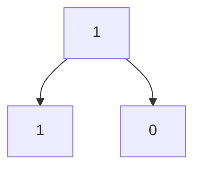

# 779. K-th Symbol in Grammar
---
tags:
  - DFS
  - traversal
  - TwoPointer
  - O_n
  - O_1space
  - Medium
  - BinarySearch
---
## Problem Statement: 

We build a table of `n` rows (**1-indexed**). We start by writing `0` in the `1st` row. Now in every subsequent row, we look at the previous row and replace each occurrence of `0` with `01`, and each occurrence of `1` with `10`.

- For example, for `n = 3`, the `1st` row is `0`, the `2nd` row is `01`, and the `3rd` row is `0110`.

Given two integer `n` and `k`, return the `kth` (**1-indexed**) symbol in the `nth` row of a table of `n` rows.

**Example 1:**

**Input:** n = 1, k = 1
**Output:** 0
**Explanation:** row 1: 0

**Example 2:**

**Input:** n = 2, k = 1
**Output:** 0
**Explanation:** 
row 1: 0
row 2: 01

**Example 3:**

**Input:** n = 2, k = 2
**Output:** 1
**Explanation:** 
row 1: 0
row 2: 01
## Logic & Algorithms:

We might first try to simulate this problem, but that is O(k * n) time which is too slow for our constraints. Rather, we need to traverse right to the symbol in grammar we need only dealing with the symbol that matters for our final symbol at every level, thus O(n levels * 1 symbol/level) time or O(n) time.

It's best to think of this problem as a tree. The root is always 0, then we need to navigate down `n-1` rows and branch such that we land up at the `kth` element (1-indexed). To get down to the `nth` level of the tree we simply need to branch down `n - 1` times from the root. However the logic for determining when to go left or right is a little more complicated.

The first thing we need to see is a pattern branching from any element. Look at the visualizations below


  ```mermaid
graph TD 
A[0] --> B[0] 
A[0] --> C[1]
```
The pattern here is that at either node 0 or 1, if we go left we stay the ==same==, if we go right we ==swap== either 0 to 1 or 1 to 0

The next thing to realize is that we can use two pointers at the extremes of the array and the mid value to determine whether to go left or right at any time very similar to binary search. Similar to binary search, with each direction chosen, we cut the number of nodes in the tree we could navigate to at the nth level in half. We initialize left to 1 and right to $2^{n - 1}$ which is the number of nodes at level `n` (1-indexed). This is very intuitive by imagining if `n` was 1 we want $2^0 = 1$ nodes thus we take 2 to the n -1.

If the mid value is <= k then we want to go left, set right = mid, otherwise we go right, swap the current value of the grammar and set left = mid + 1. This is a sort of #DFS right to the node/symbol we want
## Pseudo Code:

1. Initialize current symbol to 0 for the root
2. Initialize left and right pointers to 1 and $2^{n - 1}$
3. For each level from 1 to n - 1
	1. Calculate the mid value same as binary search `mid = left + (right - left)/2`
	2. If `k <= mid`
		1. Go left, right = mid, left side is inclusive of mid
	3. Else
		1. Go right 
		2. Swap value of current value (if it was 0 then 1 else 0)
		3. left = mid + 1, right side is not inclusive of mid value
4. Return the current symbol was at the `nth` level and `kth` node
## Time Complexity O(n) - Branching n times in the tree
## Space Complexity O(1) - Two pointers and current symbol 
## Java Code:

## DFS Tree Traversal O(n) time
```java
class Solution {
    public int kthGrammar(int n, int k) {
        int currentValue = 0;
        int left = 1;
        int right = (int)Math.pow(2, n - 1);
        for(int i = 1; i < n; i++){
            int mid = left + (right - left) / 2;
            if(k <= mid){
                right = mid;
            }
            else{
                currentValue = currentValue == 0 ? 1 : 0;
                left = mid + 1; 
            }
        }
        return currentValue;
    }
}
```

## Simulation Code O(n k) time ==***Too Slow***==
```java
class Solution {
    public int kthGrammar(int n, int k) {
        int[] previousRow = new int[]{0};
        for(int i = 2; i <= n; i++){
            int[] currentRow = new int[previousRow.length * 2];
            for(int j = 0; j < previousRow.length; j++){
                int previousInt = previousRow[j];       
                int firstIndex = j * 2;
                int secondIndex = j * 2 + 1; 
                switch(previousInt){
                    case 0:
                        currentRow[firstIndex] = 0;
                        currentRow[secondIndex] = 1;
                        break;
                    case 1:
                        currentRow[firstIndex] = 1;
                        currentRow[secondIndex] = 0;
                        break;
                }
            }
            previousRow = currentRow;
        }
        return previousRow[k - 1];
    }
}
```
